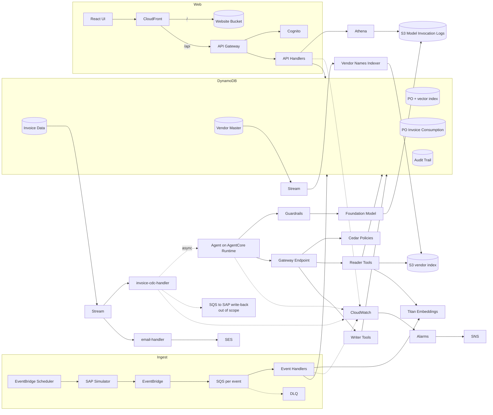

# Invoice-on-Hold Agent — Architecture

Text companion to `invoice-on-hold.drawio`. Describes the components, the boundaries between them, and the path an invoice takes from an SAP event to a human decision.

The design resolves invoices parked for **PO mismatch** on 2-way value-based POs: the invoice cites a purchase order that exists but belongs to a different vendor, often a sister entity of the same supplier group. An agent investigates as soon as the invoice is parked, recommends a resolution with evidence, and a human accepts or rejects.

---

## 1. Diagram conventions

| Convention               | Meaning                                                                   |
| ------------------------ | ------------------------------------------------------------------------- |
| Solid arrow              | Synchronous call or managed integration                                   |
| Dashed arrow             | Asynchronous invoke, telemetry, or manual redrive                         |
| Lettered connector (A–E) | Same edge continued elsewhere on the canvas, to avoid long crossing lines |
| Numbered marker          | Position in the main flow (§3)                                            |
| "Out of Scope" marker    | Drawn for completeness, not built in the POC                              |

Group-to-group edges are deliberate: `API Handlers → B → DynamoDB Tables` and `Gateway → DynamoDB Tables` stand for several per-component edges that would otherwise obscure the canvas. The Gateway edge is labelled `reader: reads / writer: writes` because the split in permissions is the point of the grouping (§5).

Connectors:

| Connector | Carries                                                    |
| --------- | ---------------------------------------------------------- |
| A         | Vendor Master Data stream to the Vendor Names Indexer      |
| B         | API Handlers to the DynamoDB tables                        |
| C         | Logs and traces from every compute component to CloudWatch |
| D         | audit-trail-handler to Athena                              |
| E         | Reader Tools to the Vendor Names Index File in S3          |

---

## 2. Component groups

### Ingestion

| Component                       | Type                   | Role                                                                                 |
| ------------------------------- | ---------------------- | ------------------------------------------------------------------------------------ |
| SAP Integration Suite           | External, out of scope | Publishes S/4HANA business events through the EventBridge receiver adapter           |
| SAP Integration Suite Simulator | Lambda                 | Stands in for the above; publishes identical event shapes from seed datasets         |
| EventBridge Scheduler           | Scheduler              | One-off trigger that runs the simulator                                              |
| EventBridge                     | Bus                    | Routes each detail-type to its domain queue                                          |
| SQS Per Event + DLQ             | Queues                 | One standard queue per domain, each with its own dead letter queue                   |
| Event Handlers                  | Lambdas                | PO Handler, Invoice Handler, Master Data Handler. Idempotent, order-tolerant upserts |

### Data

| Table                       | Holds                                                                           |
| --------------------------- | ------------------------------------------------------------------------------- |
| PO Table With Vector Index  | Purchase order headers and lines, with a vector index over line text            |
| Vendor Master Data          | Vendor master, including name, address and tax identifier                       |
| Invoice Data                | Invoice header and OCR lines, workflow status, recommendation, and run history  |
| PO Invoice Consumption Data | Derived item collection keyed by PO line, used to compute open value            |
| Audit Trail                 | Append-only record of agent recommendations, tool summaries and human decisions |

There is no separate workflow table. Status lives on the invoice item, which is what the stream filters read.

### Agent (Bedrock / AgentCore)

| Component               | Role                                                                                      |
| ----------------------- | ----------------------------------------------------------------------------------------- |
| Agent                   | LangGraph agent in Python, hosted on AgentCore Runtime                                    |
| Foundation Model        | Bedrock chat model, invoked through Guardrails                                            |
| Guardrails              | Attached at the model call. Prompt-attack filter on untrusted OCR text, masking on output |
| Amazon Titan Embeddings | Embedding model, called at ingest by the PO Handler and at query time by Reader Tools     |
| Model Invocation Logs   | S3 bucket written directly by Bedrock; the transcript system of record                    |

### Tools (AgentCore Gateway)

| Component       | Role                                                                         |
| --------------- | ---------------------------------------------------------------------------- |
| Bedrock Gateway | Holds the tool schemas, does the MCP translation, invokes the target Lambdas |
| Endpoint        | The Gateway endpoint the agent calls                                         |
| Policies        | Cedar, default-deny. Authorises each tool call by name and arguments         |
| Reader Tools    | Lambda serving every read tool                                               |
| Writer Tools    | Lambda serving `write_recommendation`, `escalate` and `resolve_invoice`      |

### Vendor name resolution

| Component               | Role                                                                 |
| ----------------------- | -------------------------------------------------------------------- |
| Vendor Names Indexer    | Lambda on the Vendor Master stream; rebuilds the normalised snapshot |
| Vendor Names Index File | Versioned S3 object holding the normalised vendor names              |

Fuzzy vendor matching is **not** vector search. Embeddings capture meaning, not spelling, which is the wrong tool for names and typos. The Reader Tools Lambda loads the snapshot into memory and scores candidates there.

### UI and API

| Component      | Role                                                          |
| -------------- | ------------------------------------------------------------- |
| UI             | React single-page app                                         |
| CloudFront     | `/` serves the Website Bucket, `/api` forwards to API Gateway |
| Website Bucket | S3, holding the built SPA                                     |
| API Gateway    | HTTP API with a JWT authorizer                                |
| Cognito        | User pool, passwordless email one-time code sign-in           |
| API Handlers   | status-handler, feedback-handler, audit-trail-handler         |
| Athena         | On-demand query over the model invocation logs                |

### Notification and observability

| Component       | Role                                                                            |
| --------------- | ------------------------------------------------------------------------------- |
| email-handler   | Lambda on the invoice stream; sends resolution and escalation email through SES |
| CloudWatch Logs | Logs and traces from every compute component                                    |
| Alarms          | Thresholds on DLQ depth, error rate and message age                             |
| SNS             | Fan-out to Emails, Teams and Slack                                              |

---

## 3. Main flow

**Ingestion**

1. The EventBridge Scheduler invokes the SAP Integration Suite Simulator as a one-off run.
2. The simulator publishes `Supplier`, `CostCentre`, `WBSElement`, `PurchaseOrder` and `SupplierInvoice` events to EventBridge. In a real deployment SAP Integration Suite publishes the same shapes through the EventBridge adapter.
3. EventBridge rules route each detail-type to its own SQS queue. Failures land in a per-queue dead letter queue after five attempts, and redrive is manual.
4. Each queue invokes its handler.
5. The PO Handler calls Titan to embed each PO line description before writing.
6. Handlers upsert into the DynamoDB tables. Upserts are idempotent and tolerate out-of-order delivery, so a change older than the stored timestamp is ignored.
7. Master data follows the same path into its own table.

**Vendor snapshot**

8. The Vendor Master Data stream invokes the Vendor Names Indexer, which rebuilds the normalised name snapshot and writes a new version of the index file to S3. A full rebuild rather than a merge means two concurrent invocations cannot lose each other's changes.

**Agent run**

9. The Invoice Data stream invokes `invoice-cdc-handler` behind an event source mapping filter. The handler reads the invoice status. A parked invoice triggers an agent run; a posted invoice publishes to the out-of-scope write-back queue.
10. The handler invokes the Agent asynchronously, so a long agent run does not block the stream shard behind it.
11. The Agent reasons over the invoice. Model calls pass through Guardrails to the foundation model; tool calls go to the Gateway endpoint, where Cedar policies authorise them before Reader or Writer Tools run. Bedrock writes every model call to the Model Invocation Logs bucket, tagged with the SAP document number, company code and run identifier.

Within a run the agent gathers the invoice, cited PO and vendor history, then searches for candidate PO lines. Candidate search is two-stage: resolve possible vendor identities against the in-memory snapshot, then fan out one vector search per candidate vendor against the vendor-partitioned index. A global index serves as a rare fallback when the partitioned search finds nothing, and its hits count as weaker evidence. The run ends by writing a recommendation or escalating.

**Human decision**

18. A reviewer opens the invoice in the UI and sees the recommendation, the evidence, the candidates considered and the confidence.
19. They accept, which resolves the invoice, or reject with comments, which returns it for rework and re-enters the flow at the invoice stream.

Email leaves the system from `email-handler` on the invoice stream, never from a tool, so no role on the agent path holds permission to send mail. Because the handler keys on the state transition, a redrive or a rework run cannot send the same message twice.

**Out of scope**

15. `invoice-cdc-handler` publishes posted invoices to a queue.
16. The queue invokes the SAP Handler, which is the only component inside a VPC.
17. The SAP Handler writes documents back to SAP Integration Suite.

A queue is used here, unlike on the agent path, because SAP is an external system that can be unavailable for an extended period and messages need somewhere durable to wait.

> Markers 12 to 14 are unused. They were retired when the queue and invoker were removed from the agent trigger path.

---

## 4. Why the agent trigger has no queue

The agent is invoked from a DynamoDB stream rather than through a queue. Stream records are retained for 24 hours and retried, which supplies the durability a queue would have provided. The invoke is asynchronous so that a slow run does not block other invoices on the same shard.

Three settings make this safe rather than merely workable:

- An on-failure destination on the event source mapping, with a maximum retry count and maximum record age, so a poison record does not retry for a full day.
- A conditional status update written before the agent starts, so a retry cannot produce a duplicate run.
- Loop prevention in the event source mapping filter, so the agent's own writes do not re-invoke the handler.

The throughput ceiling is the parallelization factor per shard. For the expected volume this is ample, and it is the first thing to revisit at enterprise scale.

---

## 5. Permission boundaries

Tool Lambdas are grouped by what they are allowed to touch, not one per tool. Grouping holds cold starts to at most two per agent run instead of one per tool, while each role stays narrow enough to defend in a review.

| Lambda        | Trigger        | Permissions                                                                                                    |
| ------------- | -------------- | -------------------------------------------------------------------------------------------------------------- |
| Reader Tools  | Gateway target | Read on the PO, vendor, invoice and consumption tables; read the vendor index file; invoke the embedding model |
| Writer Tools  | Gateway target | Update the invoice item, put to the audit trail                                                                |
| email-handler | Invoice stream | Send email from one verified SES identity                                                                      |

Two independent controls sit on every write. Cedar at the Gateway authorises by tool name and arguments; the IAM role of the executing Lambda authorises by resource and action. Neither alone is the control.

Bedrock permissions are scoped per principal: the Runtime role reaches the chat model and the guardrail, while the PO Handler and Reader Tools reach only the embedding model. Nothing else in the account holds a Bedrock permission. No VPC endpoint is involved, because network position is not what authorises these calls.

---

## 6. Audit and observability

Three layers, each for a different reader:

- **DynamoDB Audit Trail** holds the facts: who did what, when, with the recommendation, confidence and decision. Append-only, and fast enough to render the invoice timeline in the UI.
- **Model Invocation Logs** in S3 hold the full text of every model call, written by Bedrock rather than by application code. Tagged with the document number, company code and run identifier, they are queried through Athena over a date range when someone needs to see exactly what the model saw. The `audit-trail-handler` reaches them through connector D.
- **CloudWatch** holds logs and traces for operations, feeding alarms and SNS fan-out to email, Teams and Slack.

A run is only reproducible if its header records the model, the prompt version, the tool schema version and the vendor snapshot version. That envelope is written with the run.

An evaluation element is not yet on the diagram. The POC measures accuracy with a replay script over a labelled expected-resolutions set; the floating "evaluates metrics" connector is where a managed evaluation component will attach.

---

## 7. Architecture at a glance

